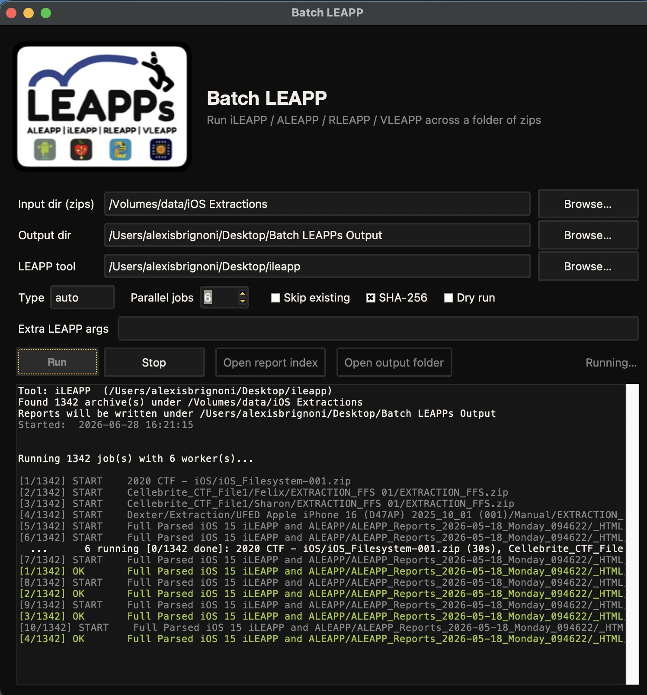
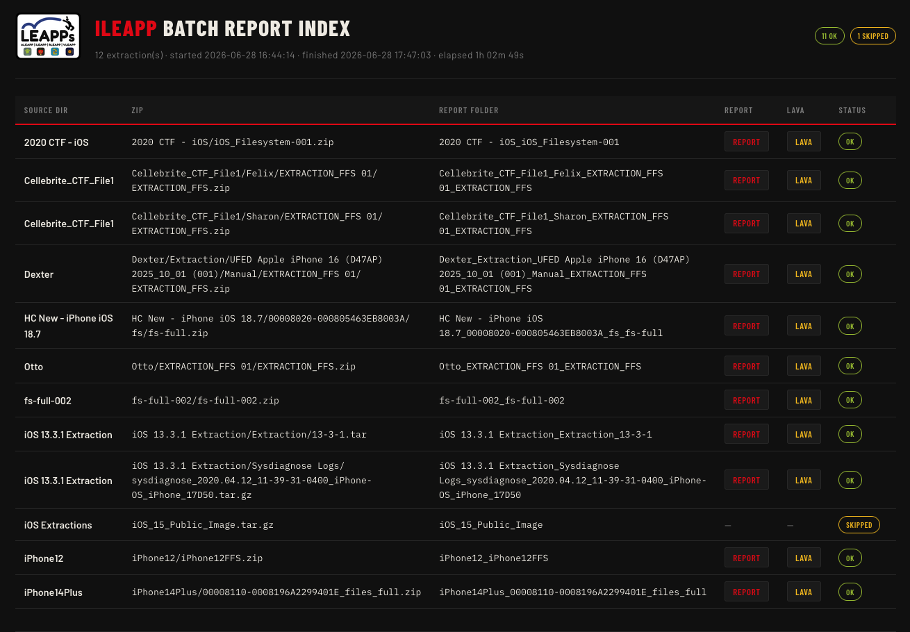
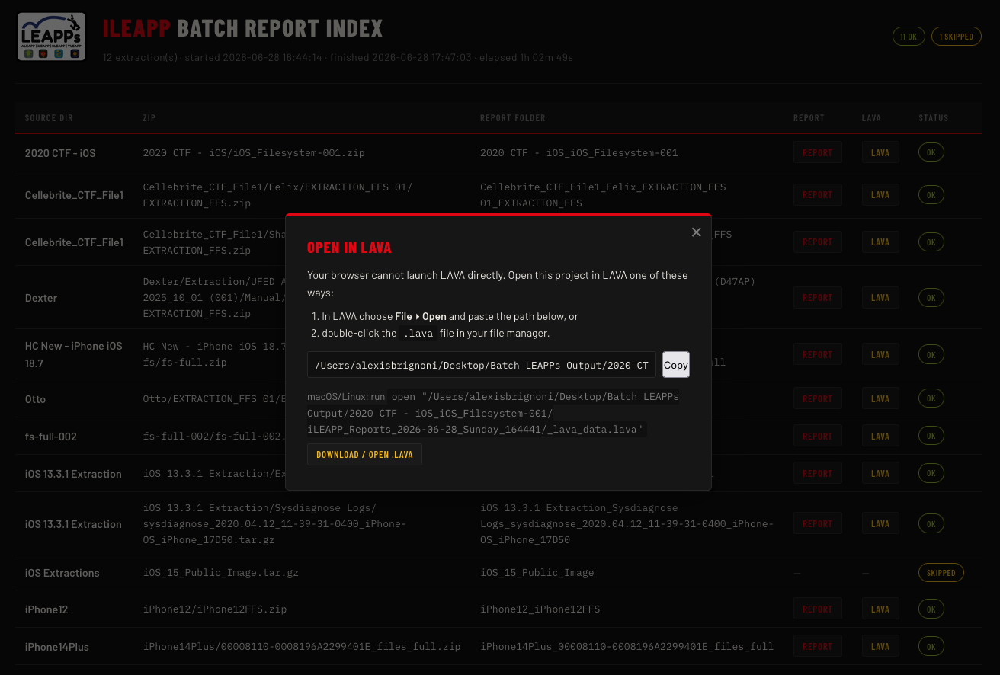

# batch_leapp.py

[](https://github.com/abrignoni/batch-leapp/releases/latest)
[](https://github.com/abrignoni/batch-leapp/releases)


Recursively find every `.zip` in a directory and run a **LEAPP** tool — [iLEAPP](https://github.com/abrignoni/iLEAPP), [ALEAPP](https://github.com/abrignoni/ALEAPP), [RLEAPP](https://github.com/abrignoni/RLEAPP), or [VLEAPP](https://github.com/abrignoni/VLEAPP) — on each one, producing a folder full of ready-to-review report directories plus a single master `index.html` that links them all.

Point it at a directory of extractions, walk away, and come back to a review-ready set of LEAPP reports.

> 📦 **[Download the latest release](https://github.com/abrignoni/batch-leapp/releases/latest)** — prebuilt macOS & Windows apps, no Python required.

<p align="center"></p>

---

## Download

Prebuilt apps — no Python required:

| Platform | GUI | CLI |
|---|---|---|
| 🍎 macOS (Apple Silicon) | [Batch LEAPP.app](https://github.com/abrignoni/batch-leapp/releases/latest/download/Batch-LEAPP-macos-arm64.zip) | [batch-leapp](https://github.com/abrignoni/batch-leapp/releases/latest/download/batch-leapp-macos-arm64.tar.gz) |
| 🪟 Windows (x64) | [Batch LEAPP.exe + CLI](https://github.com/abrignoni/batch-leapp/releases/latest/download/Batch-LEAPP-windows-x64.zip) | — |

First launch is unsigned — see [first-run notes](#signing--first-run-warnings). Prefer to run from source or build your own? See [Usage](#usage) and [Building standalone binaries](#building-standalone-binaries).

---

## What it does

- **Recursively** finds every *extraction* archive (`.zip`, `.tar`, `.tar.gz`/`.tgz`, gzipped-tar `.gz`) under the input directory and auto-selects the matching `-t` type per file. It deliberately **ignores prior LEAPP report folders** (`*LEAPP_Reports_*`) and lone non-tar `.gz` files (browser-cache blobs, single logs) so it doesn't mistake report artifacts for extractions.
- Runs your chosen LEAPP tool on each archive into **its own output folder**, so reports never overwrite each other.
- **Hashes every input** (SHA-256) and writes a **manifest** (`manifest.csv` + `manifest.json`) documenting what was processed — chain-of-custody for your case file.
- **Pre-checks each archive** and flags a corrupt/mislabeled one as `invalid` instead of letting the LEAPP run crash.
- Writes a **master `index.html`** at the root of the output directory with one row per extraction, linking the report folder, the LEAPP `index.html`, and the `_lava_data.lava` file — plus the input's SHA-256.
- Adds a **Source dir** column showing the top-level directory each archive came from (handy for grouping by case).
- **Keeps going on failure** — one bad archive won't stop the batch — and prints an ok/failed/invalid/skipped summary at the end.
- Optionally runs **multiple LEAPP processes in parallel**, and can pass **extra arguments** straight through to the tool.

iLEAPP, ALEAPP, RLEAPP and VLEAPP all share the same command line — `python <x>leapp.py -t zip -i <zip> -o <out>` — so the same script drives any of them. The tool is auto-detected from the script filename you pass to `--leapp` and used for labels, the per-job log filename, and the index title.

---

## Requirements

- Python 3.8+ (standard library only — nothing to `pip install`).
- A working LEAPP tool. You point `--leapp` at **either**:
  - a script — `ileapp.py`, `aleapp.py`, `rleapp.py`, `vleapp.py`, or
  - a **compiled CLI binary** / macOS **`.app`** from a LEAPP release (`ileapp`, `iLEAPP.exe`, `iLEAPP.app`, …).
  - (Use the command-line build, not the interactive GUI build — the GUI doesn't take batch arguments. batch-leapp warns if the name looks like a GUI.)
- If a `.py` tool lives in its own virtual environment, point `--python` at that environment's interpreter (ignored for binaries).
- The optional GUI uses **Tkinter** (bundled with most Python installs; on some Linux distros: `sudo apt install python3-tk`).

---

## Usage

### GUI

```bash
python batch_leapp_gui.py
```

Pick the input dir, output dir, and LEAPP tool, set parallel jobs, and click **Run** — a live log streams in the window, with **Stop**, **Open report index**, and **Open output folder** buttons. It tries to auto-detect an installed LEAPP tool to prefill the field.

**Remembers your paths.** Each field has a **Recent ▾** button listing the input dirs, output dirs, and LEAPP tools you have used before, and the GUI prefills all three with your last-used values on launch. History is saved per-user (macOS `~/Library/Application Support/BatchLEAPP/`, Windows `%APPDATA%\BatchLEAPP\`, Linux `~/.config/BatchLEAPP/`); each menu has a **Clear recent** entry.

Prefer a double-clickable app with no terminal? See **[Building standalone binaries](#building-standalone-binaries)** below.

### Command line

```bash
python batch_leapp.py INPUT_DIR OUTPUT_DIR --leapp /path/to/<x>leapp.py
```

- `INPUT_DIR` — directory searched recursively for `.zip` files.
- `OUTPUT_DIR` — where the per-zip report folders and the master `index.html` are written (created if it doesn't exist).

### Examples

iLEAPP:

```bash
python batch_leapp.py /Volumes/Cases/ios /Volumes/Cases/ios_reports \
    --leapp ~/tools/iLEAPP/ileapp.py
```

ALEAPP:

```bash
python batch_leapp.py /Volumes/Cases/android /Volumes/Cases/android_reports \
    --leapp ~/tools/ALEAPP/aleapp.py
```

Compiled binary / macOS `.app` (no Python needed for the tool itself):

```bash
python batch_leapp.py /Volumes/Cases/ios /Volumes/Cases/ios_reports \
    --leapp /Applications/iLEAPP.app
```

Open the result:

```bash
open /Volumes/Cases/ios_reports/index.html
```

---

## Options

| Option | Default | Description |
|---|---|---|
| `--leapp PATH` | `ileapp.py` | Path to the LEAPP **script** (`ileapp.py` …) **or compiled binary / macOS `.app`**. `--ileapp` is accepted as an alias. |
| `--python PATH` | current interpreter | Python used to run a `.py` tool (point at the tool's venv if it has one). Ignored for binaries. |
| `-t`, `--type TYPE` | `auto` | `auto` picks the `-t` value (`zip`/`tar`/`gz`) per file from its extension. Any other value forces that type for every archive. |
| `-j`, `--jobs N` | `1` | Number of LEAPP runs to execute in parallel. |
| `--heartbeat SECONDS` | `30` | In parallel mode, print a "still running" line every N seconds so long runs don't look hung (`0` disables). |
| `--timeout SECONDS` | none | Per-zip timeout; a run exceeding it is marked failed and the batch continues. |
| `--no-hash` | off | Skip computing the SHA-256 of each input archive (hashing is on by default). |
| `--skip-existing` | off | Skip a zip whose output folder already exists and is non-empty (resume a partial run). |
| `--dry-run` | off | Print the exact commands without running the tool. |
| `-- <args>` | — | Everything after a literal `--` is appended verbatim to every LEAPP run (e.g. `-- -p fast` for an iLEAPP profile). |

> **Passing extra args:** batch-leapp owns `-o` (it gives each extraction its own output folder), so don't pass your own `-o` through `--` — it would send every report to the same place. To rename the report folder use iLEAPP's `--custom_output_folder` instead (e.g. `-- --custom_output_folder MyReports`); it renames the folder *inside* each per-zip output dir, so there's no collision and the index/manifest still find every report.

---

## Building standalone binaries

You can package batch-leapp into native binaries that don't need Python installed — a double-clickable **GUI app** and a single-file **CLI binary** — using [PyInstaller](https://pyinstaller.org/). Build scripts and icons are included.

> **Cross-compiling isn't supported:** build the macOS binaries on a Mac and the Windows binaries on Windows. Each build also targets the machine's own CPU architecture; the bundled scripts and CI target Apple Silicon on macOS.

One-time setup on each machine:

```bash
python3 -m pip install pyinstaller
```

### macOS

```bash
./build_macos.sh          # both: dist/Batch LEAPP.app  +  dist/batch-leapp
./build_macos.sh gui      # just the .app
./build_macos.sh cli      # just the CLI binary
```

Drag `Batch LEAPP.app` to `/Applications`. To share it, zip with `ditto` (preserves the bundle):

```bash
ditto -c -k --sequesterRsrc --keepParent "dist/Batch LEAPP.app" Batch-LEAPP-macos.zip
```

### Windows

```bat
build_windows.bat         :: both: dist\Batch LEAPP.exe  +  dist\batch-leapp.exe
build_windows.bat gui     :: just the GUI .exe
build_windows.bat cli     :: just the CLI .exe
```

### Signing & first-run warnings

The binaries are **unsigned** (notarizing/signing needs a paid Apple Developer ID or a Windows code-signing certificate). They run fine on the machine that built them; when shared:

- **macOS** — Gatekeeper says "Apple cannot check it for malicious software." Right-click → **Open** once, or run `xattr -dr com.apple.quarantine "Batch LEAPP.app"`.
- **Windows** — SmartScreen shows "Windows protected your PC." Click **More info → Run anyway**.

> **The quarantine flag.** Anything downloaded from the internet — a GitHub Actions artifact or Release asset, a browser download, email, or AirDrop — gets macOS's `com.apple.quarantine` extended attribute. That attribute is what triggers the Gatekeeper prompt above; it is **not** set on binaries you built locally, which is why those open without complaint. To clear it for a downloaded build, right-click → **Open** once, or strip it from the Terminal:
> ```bash
> xattr -dr com.apple.quarantine "Batch LEAPP.app"   # or: xattr -d com.apple.quarantine batch-leapp
> ```
> Windows has an equivalent "Mark of the Web" — right-click the file → **Properties** → tick **Unblock**, or just **More info → Run anyway** at the SmartScreen prompt.

If you have signing certificates, add the `codesign`/`signtool` step to the build scripts and I can wire it in.

### Automated builds (GitHub Actions)

[`.github/workflows/build.yml`](.github/workflows/build.yml) builds everything in the cloud — **macOS (Apple Silicon)** and **Windows**, GUI and CLI — so you don't need a Windows machine. Two ways to run it:

- **On demand:** GitHub → **Actions** tab → **Build binaries** → **Run workflow**. The binaries appear as downloadable **artifacts** on the run page.
- **On a release:** push a version tag and the binaries are attached to a GitHub **Release** automatically:
  ```bash
  git tag v1.0.0 && git push origin v1.0.0
  ```

Artifacts produced: `Batch-LEAPP-macos-arm64.zip` (the `.app`), `batch-leapp-macos-arm64.tar.gz` (the CLI), and `Batch-LEAPP-windows-x64.zip` (GUI + CLI `.exe`). They're still unsigned — the same first-run steps apply. Apple Silicon covers every Mac since 2020; Intel macOS builds were dropped.

---

## Recommended first run

Always sanity-check the zip list and commands before turning it loose on a case load:

```bash
python batch_leapp.py INPUT_DIR OUTPUT_DIR --leapp /path/to/<x>leapp.py --dry-run
```

---

## Parallel runs

```bash
python batch_leapp.py INPUT_DIR OUTPUT_DIR --leapp /path/to/<x>leapp.py -j 4
```

- Output dirs are assigned **before** any run starts, so names never collide.
- In parallel mode each run's output is captured to `<tool>_run.log` (e.g. `aleapp_run.log`) inside that extraction's folder, so concurrent runs don't garble the terminal; the screen shows just `OK` / `FAILED` / `TIMEOUT` per zip as they finish.
- With `-j 1` (the default), the tool's output streams live as usual.

### Why parallel runs need isolation

LEAPP tools keep one **shared** history/settings file (e.g. macOS `~/Library/Application Support/LEAPP/history.json`) and update it with a read-modify-write that uses a fixed temp filename. Two tools running at once race on that file — one wins the rename, the other dies with `history.tmp -> history.json: No such file`, and a later read sees a half-written file (`JSONDecodeError: Extra data`).

To avoid this, **parallel runs (`-j > 1`) each get a private config dir** at `<output>/<zip>/.leapp_home/`, set via `HOME` / `APPDATA` / `XDG_CONFIG_HOME`. Consequences:

- Concurrent runs never touch the same history file, so no corruption.
- Your real, user-level LEAPP history is left untouched and parallel runs are **not** recorded in it (an empty private config dir means history recording is simply off for those runs).
- Sequential runs (`-j 1`) use your normal config dir and record history as usual.

> **Caution:** LEAPP runs are CPU-, disk-, and RAM-heavy. On a typical workstation `-j 2`–`-j 4` is a sane range. Pushing to your full core count can thrash disk I/O and run *slower* — and large extractions can exhaust memory. Start conservative.

---

## Console output

Every run prints a banner (detected tool, zip count, output dir, **start time**) and a running **`[done/total]` progress counter** so you always know how far along the batch is.

Sequential (`-j 1`) — the tool's own output streams live, framed by counter lines:

```
[1/4] running: caseA/a.zip
... live iLEAPP/ALEAPP output ...
[1/4] OK       caseA/a.zip  (37s)
[2/4] running: caseB/b.zip
```

Parallel (`-j > 1`) — verbose output goes to the per-job log, so the screen instead shows a `START` line when each worker picks up a zip, a periodic **heartbeat** of what's still running (so long jobs never look hung), and a counter line as each completes (the counter climbs `1 → total` in completion order):

```
Running 4 job(s) with 2 worker(s)...
  START    caseA/a.zip
  START    caseB/b.zip
  ...      2 running [0/4 done]: caseA/a.zip (30s), caseB/b.zip (30s)
[1/4] OK       caseA/a.zip  (37s)
  START    caseC/c.zip
  ...      2 running [1/4 done]: caseB/b.zip (60s), caseC/c.zip (23s)
[2/4] OK       caseB/b.zip  (66s)
  ...
```

The heartbeat interval is `--heartbeat SECONDS` (default 30; `0` disables it). It lists up to four in-flight zips with their elapsed times, plus `+N more` if more are running.

It ends with the master-index path and a summary block — counts plus **start, finish, and elapsed** time (and a list of any failures):

```
Done. 12 ok, 1 failed, 0 skipped.
Started:  2026-06-27 09:14:02
Finished: 2026-06-27 11:48:37
Elapsed:  2h 34m 35s
```

The same start/finish/elapsed times also appear in the master index header.

---

## Input layout

batch-leapp searches `INPUT_DIR` recursively, so you can arrange it however suits the case. The cleanest layout is **one folder per case or device**, holding just that extraction's archive:

```
Cases/                     ← point INPUT_DIR here
├── 2024-001_iPhone15/
│   └── extraction.zip
├── 2024-002_Pixel8/
│   └── fullfs.tar.gz
└── 2024-003_iPadAir/
    └── backup.zip
```

The top-level folder name (e.g. `2024-001_iPhone15`) becomes the **Source dir** column in the report index and manifest, so name it however you want runs grouped and identified.

A couple of guidelines:

- **Keep the output directory outside the input tree.** Point `OUTPUT_DIR` somewhere separate (or a sibling) so reports never land back inside what you're scanning.
- **Don't mix prior LEAPP reports into the input.** batch-leapp already ignores `*LEAPP_Reports_*` folders, the output dir, and lone non-tar `.gz` files, but an input directory of *just extractions* is the safest setup and makes the `--dry-run` preview easy to sanity-check.
- A flat folder of archives works too — they'll all share `INPUT_DIR`'s name as their Source dir.

---

## Output layout

```
OUTPUT_DIR/
├── index.html                      ← master index (open this)
├── manifest.csv                    ← run manifest: hash, status, paths, times
├── manifest.json                   ← same, machine-readable, + run metadata
├── caseA_phone/                    ← one folder per archive
│   ├── ileapp_run.log              ← captured tool output (parallel mode)
│   ├── .leapp_home/                ← private config dir (parallel mode only)
│   └── iLEAPP_Reports_<timestamp>/
│       ├── index.html              ← the LEAPP report
│       └── _lava_data.lava         ← the LAVA file
├── caseB_tablet/
│   └── ...
└── ...
```

(The report subfolder is named by the tool — `iLEAPP_Reports_*`, `ALEAPP_Reports_*`, etc. — and the log file is named after the detected tool.)

Per-zip folders are named from each zip's path **relative to** `INPUT_DIR` (e.g. `caseA/sub/phone.zip` → `caseA_sub_phone`), so two same-named zips in different subfolders never collide. A `_N` suffix is appended if a name still clashes.

### The master index

<p align="center"></p>

`index.html` is one table with these columns:

| Column | Meaning |
|---|---|
| **Source dir** | Top-level directory the archive came from (e.g. `caseA`). Falls back to `INPUT_DIR`'s name for archives sitting directly in it. |
| **Zip** | The archive's path relative to `INPUT_DIR`. |
| **Report folder** | Link to that extraction's output directory. |
| **Report** | Link straight to the LEAPP `index.html`. Opens in a new tab. |
| **LAVA** | Opens the `_lava_data.lava` project. Mirrors the LEAPP GUIs (see below). |
| **Status** | `ok` / `failed` / `invalid` / `skipped` / `dry-run`, color-coded. |
| **SHA-256** | First 16 chars of the input archive's hash; hover for the full digest. |

### Forensic documentation (hashes & manifest)

Every run writes two manifests at the root of `OUTPUT_DIR`:

- **`manifest.csv`** — one row per extraction: source dir, archive path, **SHA-256**, status, `-t` type, elapsed seconds, output folder, and the relative paths to the report and `.lava`.
- **`manifest.json`** — the same rows plus run metadata (tool, input/output dirs, start/finish, elapsed, counts, hash algorithm).

Hashing is on by default (stream-read, so it handles huge full-file-system extractions without exhausting RAM). Disable it with `--no-hash` if you only want the reports.

The page is styled to match **[leapps.org](https://leapps.org)** — dark gold-on-black theme, Barlow fonts, the LEAPPs logo, and a per-tool accent color (iLEAPP red, ALEAPP green, RLEAPP blue, VLEAPP purple) on the title. A summary of ok/failed/skipped counts sits in the header. The logo and favicon are **embedded** in the HTML (base64), so the page needs no external image files; the web fonts load from Google Fonts when online and fall back to system fonts offline.

Links open in a new tab so the index stays put for the next click.

### The LAVA button

This mirrors what the LEAPP GUIs do (`leapp_functions/lava_launcher.py`). When the index is generated, batch-leapp checks whether the **LAVA desktop app** is installed on the machine, using the same detection iLEAPP uses (`open -Ra LAVA` on macOS; the LAVA executable / known install paths on Windows and Linux):

- **LAVA installed** → the button (**LAVA**) opens a small in-page dialog with a one-click **Open in LAVA** button that fires the `lava://open?path=…` handler, plus the project's **full filesystem path** and a **Copy** button as a fallback (paste into LAVA's *File ▸ Open*, double-click the `.lava` in your file manager, or `open "<path>"` on macOS/Linux).
- **LAVA not installed** → the button becomes **Get LAVA**; the dialog shows the project path and a link to the download page, `https://www.leapps.org/#lava`.

<p align="center"></p>

> **The `lava://` handler.** LAVA registers a `lava://open?path=<url-encoded-abs-path>` URL scheme, so the dialog's **Open in LAVA** button hands the project straight to the app — the true one-click path. It requires a LAVA build that supports the scheme; on older builds the button does nothing, which is why the dialog keeps the copyable path and manual-open steps as a fallback. The absolute path is resolved client-side from `window.location`, so it works when the index is opened from disk (`file://`), the normal review workflow; served over `http` there's no absolute path, so the dialog shows the manual steps instead. A plain `<a>` link couldn't do this on its own: without the scheme a browser would just download the `.lava`.

All links are **relative**, so the whole `OUTPUT_DIR` is portable — zip it, move it, or drop it on a share and the links still resolve. The report and LAVA files are located by scanning each output folder, so they're found wherever the tool writes them. If a tool doesn't emit a `.lava` file, that cell simply shows `—`.

---

## Behavior notes

- **Exit code** is `1` if any archive failed or was invalid, otherwise `0` — convenient for scripting.
- **Stop / closing the GUI terminates running jobs.** LEAPP children are launched so they can be killed — clicking **Stop**, or closing the window (you'll be asked to confirm), terminates the in-flight LEAPP processes instead of leaving them running as orphans.
- **Ctrl-C** stops launching new work and still writes the master index and manifest for whatever finished.
- Rows for **failed**, **invalid**, or **skipped** extractions still appear in the index and manifest; report/LAVA links show only when those files actually exist.
- **Corrupt or mislabeled archives are flagged, not fatal.** Each archive is integrity-checked (zip central directory / tar header) before the LEAPP run; a bad one is marked `invalid` and the batch moves on.
- **macOS AppleDouble files are ignored.** On non-HFS volumes (exFAT, NTFS, SMB shares) macOS drops a `._name.zip` companion next to each real file. These are not archives, so they're skipped — otherwise a LEAPP tool would choke on one with `BadZipFile: File is not a zip file`.
- **Prior LEAPP reports and stray `.gz` files don't get re-processed.** The scan never descends into `*LEAPP_Reports_*` folders, skips the output directory, and treats a bare `.gz` as an extraction only when it's actually a gzipped tar — so the thousands of tiny browser-cache `.gz` files inside an existing report are not picked up as "extractions."
- The script is self-contained — copy it anywhere; it doesn't depend on this repository.
